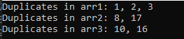

# Whiteboard Images

### Challenge: Find-Duplicates
#### challenge Descripton:
The `FindDuplicates` function in C# identifies duplicate numbers in an array and returns them.

### How it Works

- It iterates through each number in the array.
- Checks for duplicates by comparing each number with others in the array.
- Records and returns a list of duplicate numbers found.
---

