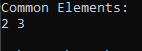
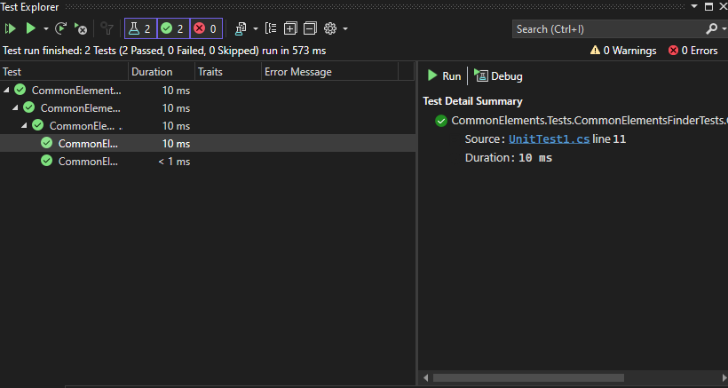

# Whiteboard Images

### Challenge: commonElement
#### challenge Descripton:
This code defines a method to find common elements between two arrays of integers without using any built-in methods, and it includes tests to ensure the method works correctly.
### How It Works

1. **Finding Common Elements**:
   - The `CommonElement` method iterates through each element in the first array and compares it with each element in the second array.
   - If a common element is found and it’s not already in the list of common elements, it’s added to the list.
   - Finally, the list of common elements is converted to an array and returned.

2. **Testing the Method**:
   - The `CommonElementTests` class contains three test cases to check the correctness of the `CommonElement` method.
   - Each test case defines two input arrays and the expected output.
   - The tests use xUnit to verify that the actual output from the `CommonElement` method matches the expected output.

