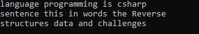
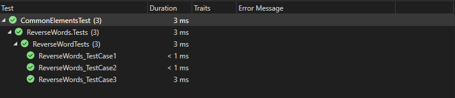

# Whiteboard Images

### Challenge: ReverseWords
#### challenge Descripton:
### Description

This project contains a function called `ReverseWords` that reverses the order of words in a given string. The project also includes unit tests to verify the correctness of the function using xUnit.

### How It Works

1. **ReverseWords Function**:
   - **Purpose**: To reverse the order of words in a given string.
   - **Implementation**:
     - Splits the input string into an array of words using `Split`.
     - Reverses the array of words using `Array.Reverse`.
     - Joins the reversed array of words back into a single string using `string.Join`.
     

2. **Unit Tests**:
   - **Purpose**: To verify the correctness of the `ReverseWords` function.
   - **Test Cases**:
     - **Test Case 1**: "csharp is programming language" should return "language programming is csharp".
     - **Test Case 2**: "Reverse the words in this sentence" should return "sentence this in words the Reverse".
     - **Test Case 3**: "challenges and data structures" should return "structures data and challenges".

