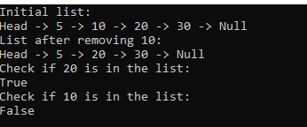

# Singly Linked List Implementation in C#

## Problem Domain

Implement a basic singly linked list data structure in C#.

## Whiteboard Images

## Inputs and Expected Outputs

- Includes(int data): Returns true if the data is present in the list, otherwise false.
- Remove(int data): Removes the first occurrence of the node with the specified data.
- PrintList(): Prints the contents of the list in order.

## Edge Cases

- Add and Print List:
- Add 5, 10, 20, 30.
- Expected: "Head -> 5 -> 10 -> 20 -> 30 -> Null"

- Remove Head:
- Start with 5, 10.
- Remove 5.
- Expected: "Head -> 10 -> Null"

## Visual

Head -> 5 -> 10 -> 20 -> 30 -> Null

## Algorithm

1. **Includes**:
   - Traverse the list to find the data.
   - Return true if found, false otherwise.
2. **Remove**:
   - Handle if the list is empty.
   - Handle if the head needs to be removed.
   - Traverse to find the node and update the references to exclude the node.
3. **PrintList**:
   - Traverse and print each node's data.

## Real Code

See the implementation in the `Node` and `LinkedList` classes.

## Big O Time/Space Complexity

- **Includes**: O(n) time, O(1) space
- **Remove**: O(n) time, O(1) space
- **PrintList**: O(n) time, O(1) space

## Test 

