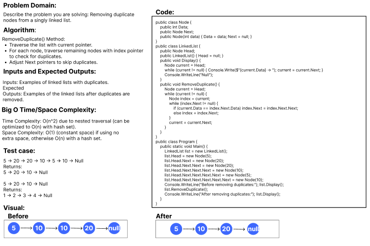
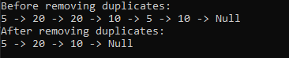

### Whiteboard Content Outline

#### Problem Domain
- Describe the problem you are solving: Removing duplicate nodes from a singly linked list.

#### Inputs and Expected Outputs
- **Inputs:** Examples of linked lists with duplicates.
- **Expected Outputs:** Examples of the linked lists after duplicates are removed.

#### Algorithm
- **RemoveDuplicate() Method:**
  - Traverse the list with `current` pointer.
  - For each node, traverse remaining nodes with `index` pointer to check for duplicates.
  - Adjust `Next` pointers to skip duplicates.

#### Big O Time/Space Complexity
- **Time Complexity:** O(n^2) due to nested traversal (can be optimized to O(n) with hash set).
- **Space Complexity:** O(1) (constant space) if using no extra space, otherwise O(n) with a hash set.

#### Test

