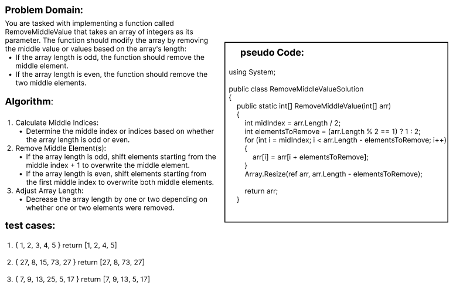

### Whiteboard Images

### Challenge 04: Remove Middle Value
#### challenge Descripton:
The RemoveMiddleValue function in C# removes the middle element(s) from an integer array based on its length:

- If the array length is odd, it removes the middle element.
- If the array length is even, it removes the two middle elements.

 Functionality:
- It calculates the middle index (midIndex) of the array.
- Determines whether to remove 1 or 2 elements (elementsToRemove) based on the array's length.
- Shifts elements to remove the middle element(s) efficiently without using direct removal methods.
- Resizes the array to adjust its length after removing the middle element(s).
- This function ensures efficient modification of the array while maintaining clarity and adhering to fundamental array manipulation techniques in C#. Adjustments can be made to handle various array sizes and edge cases effectively.
