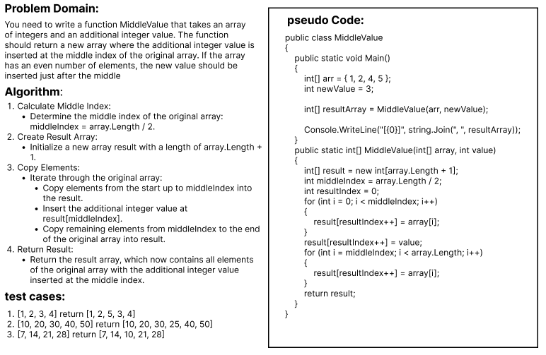

# Whiteboard Images

### Challenge: Insert-Value-in-Middle-of-Array
#### challenge Descripton:
The task is to write a function MiddleValue that takes an array of integers and an additional integer value. The function returns a new array where the additional integer value is inserted at the middle index of the original array. If the array has an even number of elements, the new value is inserted just after the middle.
